

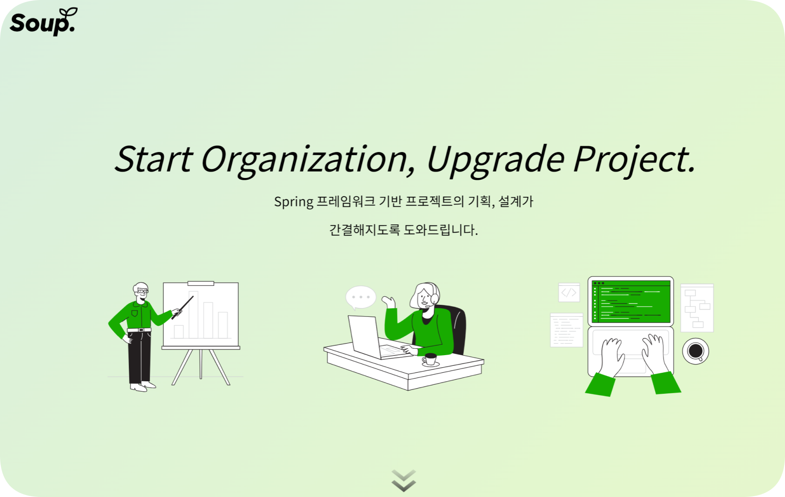
<h2>    Spring 기반 소규모 프로젝트를 쉽게 시작해보자!</h2>    
    
프로젝트를 진행하며 여러 사용자가 커서 공유 및 동시 편집 기능, 사용자 간 편집 충돌 최소화생산성을 높이고 협업 효율성을 극대화 할 수 있어요! 

        

        <a href="https://so-up.store/" target="_blank">SOUP 시작하기</a>
    

        <a href="https://www.notion.so/todays-jiwoo/SSAFY-SOUP-c9762f82ccf343babb6e43dfe4419b75" target="_blank">팀노션</a> &nbsp; &nbsp; |&nbsp; &nbsp;   <a href="" target="_blank">UCC</a>

## 목차

1. [서비스 소개](#서비스-소개)
2. [기획 배경](#기획-배경)
3. [기능소개](#-기능-소개)
4. [아키텍쳐](#아키텍쳐)

​    

## 🎨 서비스 소개

`SOUP`는 Spring을 기반으로 소규모 팀 프로젝트 및 토이 프로젝트를 쉽고 빠르게 시작할 수 있도록 지원합니다. 음성 채팅, 알림,  flow chart 작성, 기획서 작성,API, 빌드 등의 다양한 기능을 통해 팀원 간의 원활한 소통과 협업을 돕습니다. 물리적으로 떨어진 팀원들도 프로젝트를 세팅하고 진행할 수 있도록 지원합니다.

**주요 기능:**

- crdt를 이용한 동시 편집 기능
- 실시간 커서위치 공유
- 태그 및 알림 기능
- 음성 채팅 및 텍스트 채팅 기능
- JIRA 연동
- Flow Chart 작성
- ERD 작성
- API 명세서 작성
- Spring 프로젝트 빌드

------

## 기획 배경

현대의 많은 프로젝트 팀들은 물리적으로 떨어져 있는 경우가 많으며, 이는 원활한 협업에 많은 어려움을 초래합니다. 특히 소규모 팀이나 토이 프로젝트를 진행하는 팀은 제한된 자원과 시간 안에서 최대한 효율적으로 작업을 진행해야 합니다. 이러한 문제를 해결하기 위해 우리는 소규모 팀을 위한 올인원 프로젝트 스타터 서비스를 기획하게 되었습니다.

**문제점:**

1. **원활한 소통의 어려움:** 물리적으로 떨어져 있는 팀원들 간의 실시간 소통이 어려워 프로젝트 진행 속도가 느려질 수 있습니다.
2. **협업 도구의 부족:** 다양한 도구들을 사용해야 하는 번거로움과 각 도구 간의 연동 문제로 인해 협업 효율이 떨어질 수 있습니다.
3. **초기 세팅의 복잡함:** 프로젝트를 시작할 때의 초기 세팅 과정이 복잡하고 시간이 많이 소요될 수 있습니다.

**해결 방안:**

1. **통합된 협업 환경 제공:** 음성 채팅, 텍스트 채팅, 태그 및 알림 기능을 통해 팀원 간의 원활한 소통을 지원합니다.
2. **올인원 솔루션:** Flow Chart 작성, ERD 작성, API 명세서 작성 등 프로젝트 기획부터 빌드까지 한 번에 진행할 수 있는 통합된 협업 환경을 제공합니다.
3. **간편한 초기 세팅:** Spring 기반의 초기 세팅을 자동화하여 팀원들이 빠르게 프로젝트를 시작할 수 있도록 돕습니다.

## 기능 소개

## 회원가입 / 로그인

#### 

|                       메인화면                       |                    로그인                     |
| :--------------------------------------------------: | :-------------------------------------------: |
|  | 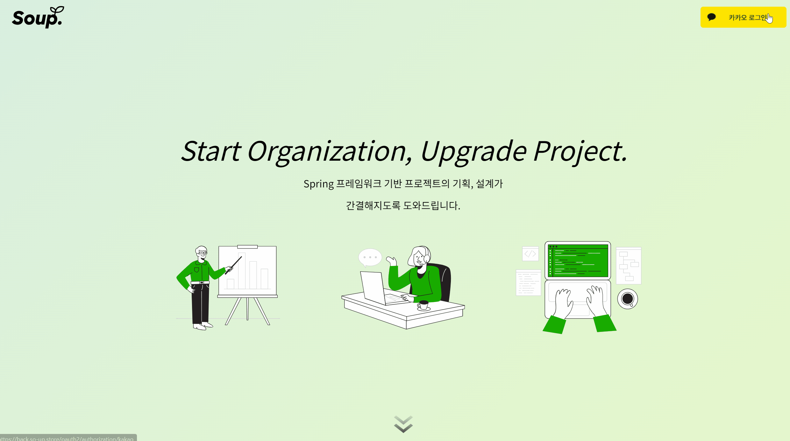 |

#### 카카오 `OAuth`

- 카카오 계정을 이용한 소셜 로그인 기능을 제공합니다.

## 프로젝트 생성 및 팀원초대

|                    프로젝트 생성                     |                     팀원초대                     |
| :--------------------------------------------------: | :----------------------------------------------: |
| 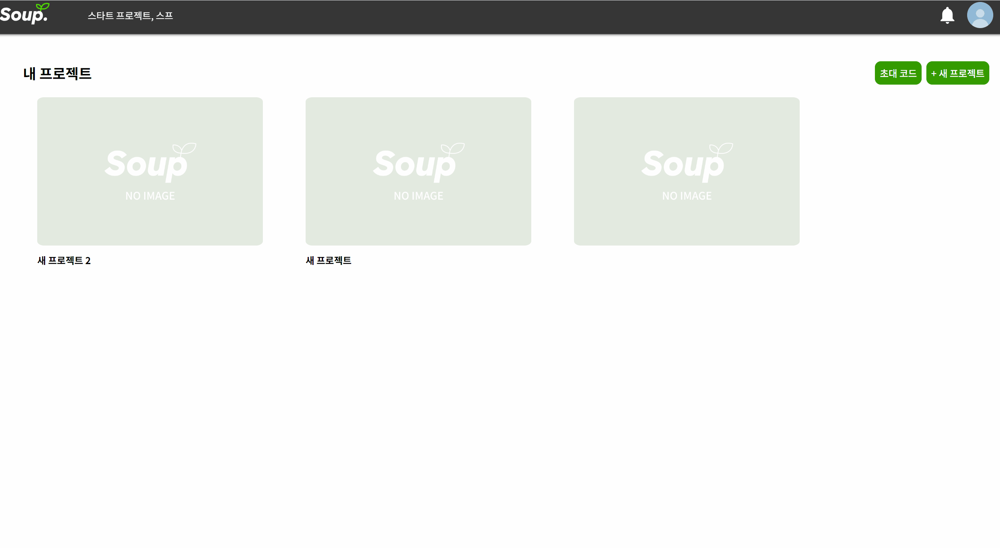 | 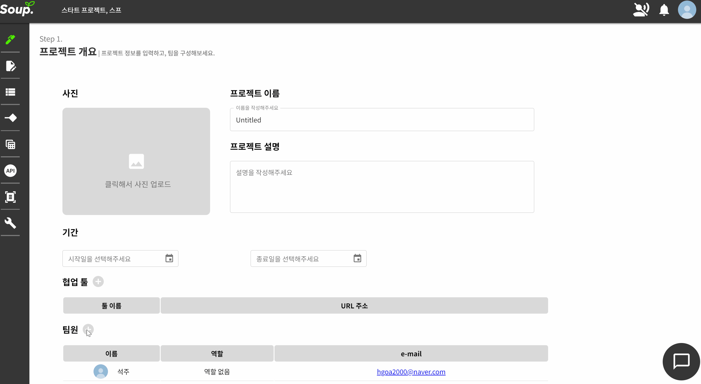 |

#### 프로젝트 생성

- 프로젝트 생성자가 팀장이 됩니다.

#### 팀원 초대

- 팀원을 초대하고 팀원별 역할을 부여합니다.

#### 마감 기한 및 일정 설정

- 프로젝트 캘린더를 생성하고 마감 기한을 설정합니다.

### 커서 공유 및 동시 편집

|              커서 공유 및 동시편집               |
| :----------------------------------------------: |
| 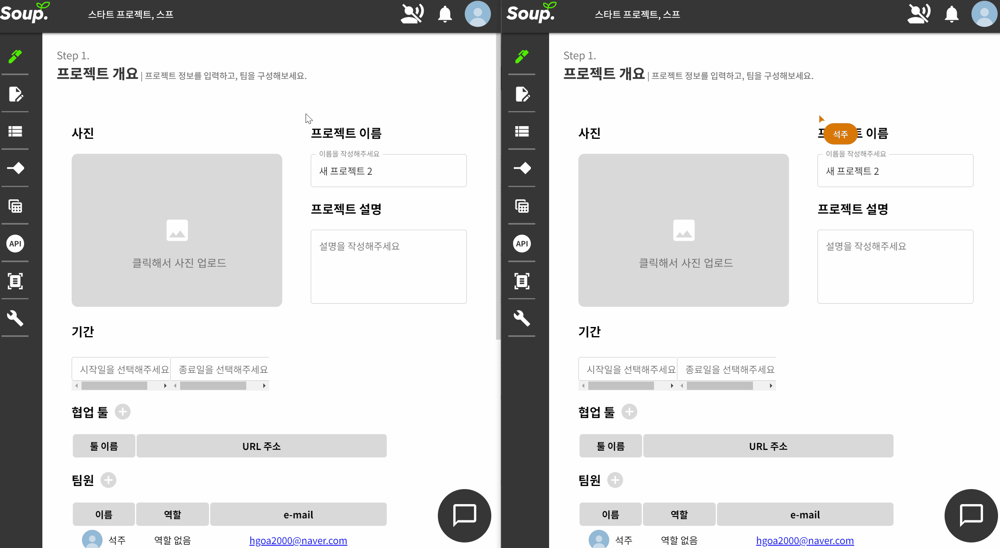 |

#### 커서공유

- 사용자간 커서를 공유하며 어느 시점을 수정 하는지 확인 할 수있습니다.

#### 동시편집

- 각 사용자는 `CRDT`기반 실시간으로 편집 할 수 있으며 협업을 원활히 진행 할 수 있습니다.

### 음성 채팅 및 텍스트 채팅

|                     음성 채팅                      |                 텍스트 채팅                  |
| :------------------------------------------------: | :------------------------------------------: |
| 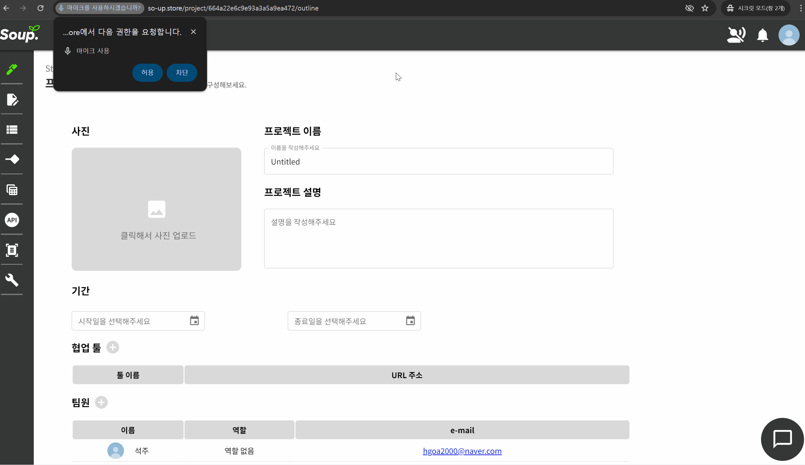 | 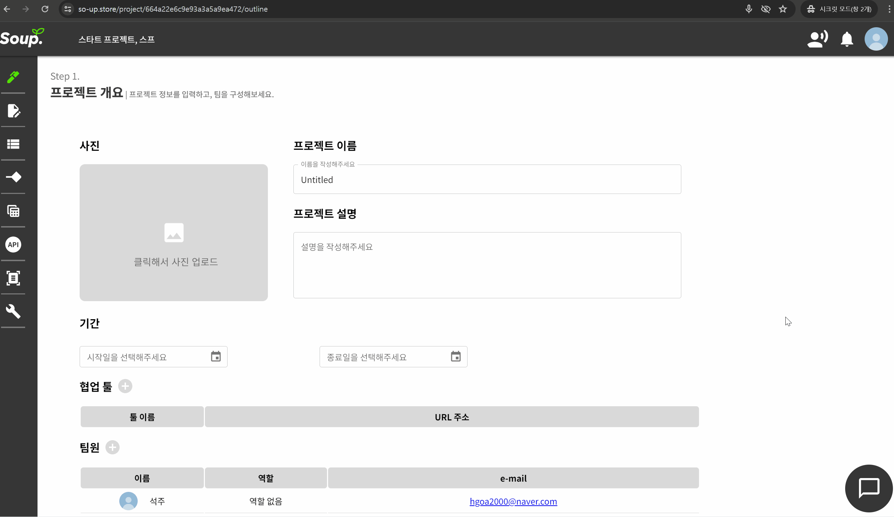 |

#### 음성 채팅

- WebRtc기반 `OpenVidu`세션에 참여 중인 팀원과 음성으로 채팅할 수 있습니다.

#### 텍스트 채팅

- WebSocket `Stomp`를 이용, 팀원끼리 텍스트 채팅이 가능합니다.

## 태그 및 알람

|                     태그                     |                     알림                     |
| :------------------------------------------: | :------------------------------------------: |
| 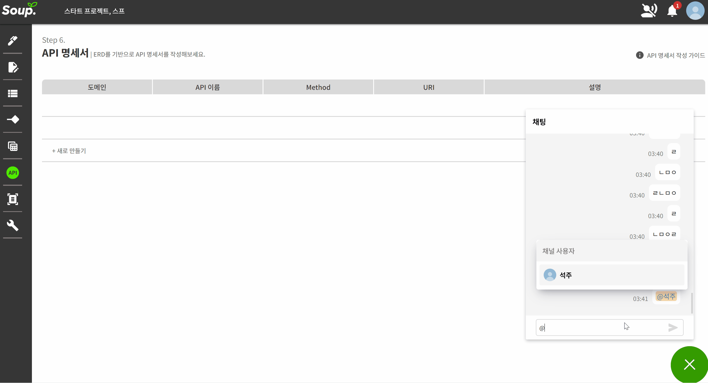 | 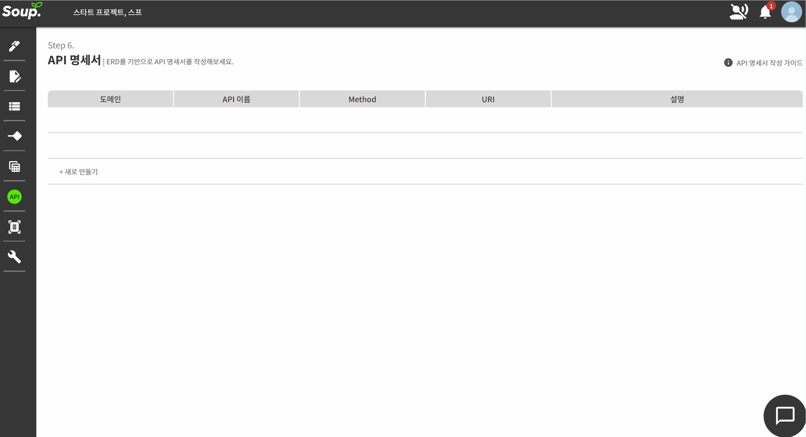 |

#### 태그 및 알림

- 텍스트에 특정 멤버를 태그하면 해당 멤버에게 `SSE`알림이 전송되며, 태그된 멤버는 해당 페이지를 확인 할 수 있습니다.

## AI기획서 및 기능명세서

|                 AI기획명세서                 |                     기능명세서                     |
| :------------------------------------------: | :------------------------------------------------: |
| 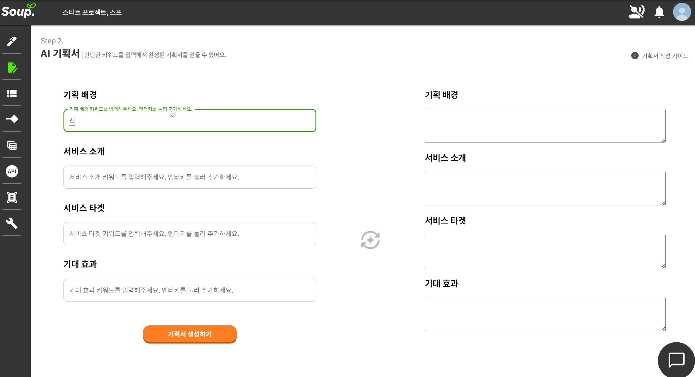 | 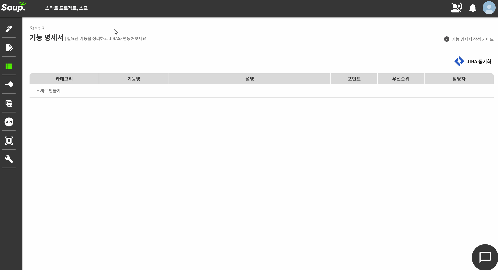 |

### AI기획서

- 생성형 AI를 활용해 키워드를 입력하면 서술형으로 작성해줍니다.

### 기능 명세서

- 요구사항은 JIRA에 Epic으로 등록할 수 있습니다.

## FlowChart ERD

|                     플로우차트                     |                     ERD                     |
| :------------------------------------------------: | :-----------------------------------------: |
| 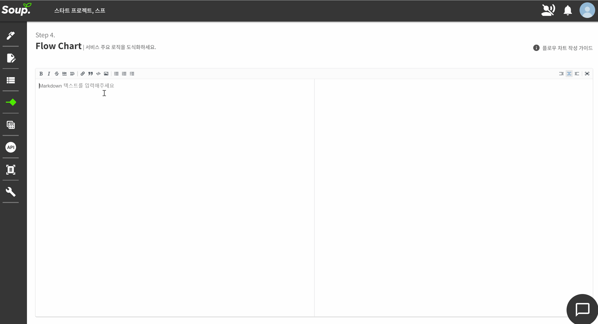 | 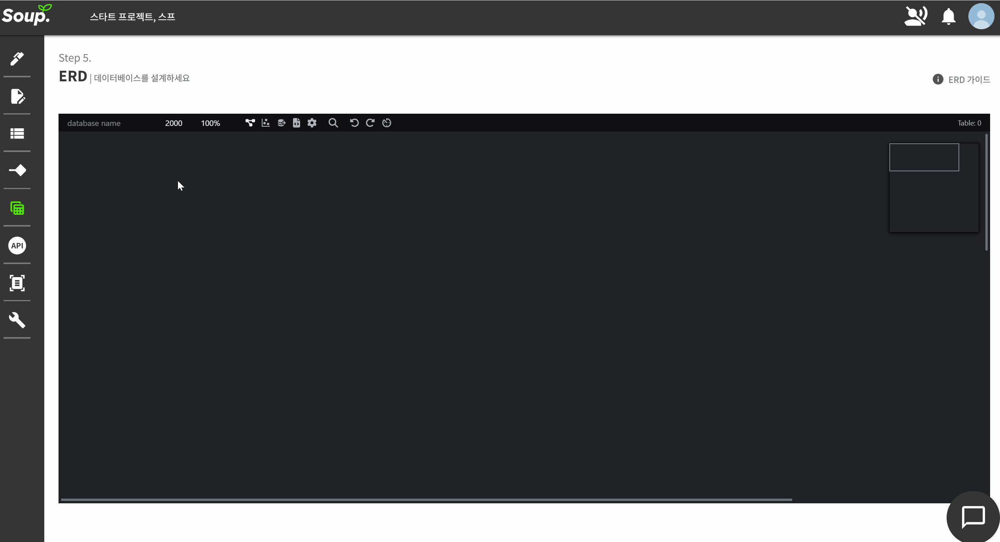 |

#### Flow Chart

- mermaid.js를 사용하여 실시간으로 Flow Chart를 작성 할 수 있습니다.

#### ERD 작성

- 툴을 이용하여 쉽게 실시간 erd 작성을 할 수 있습니다.

## API

|                   API추가                    |                 API 내용입력                 |
| :------------------------------------------: | :------------------------------------------: |
| 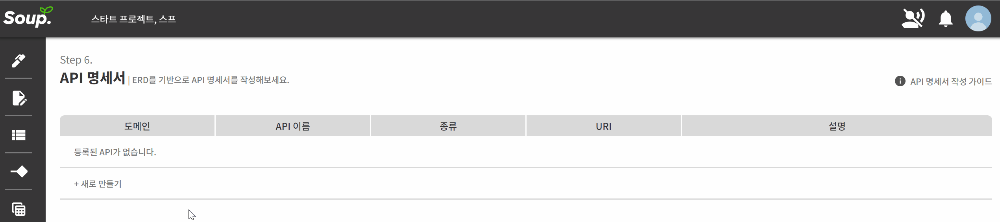 | 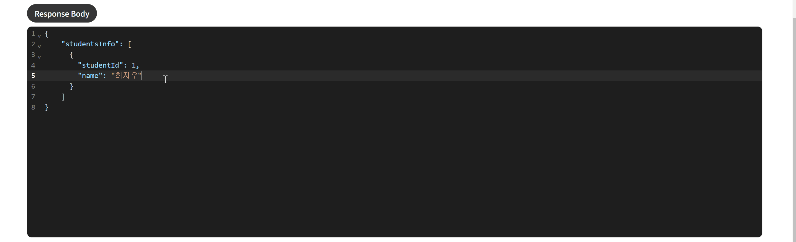 |

### 

|                   API입력                    |                API 데이터삭제                |
| :------------------------------------------: | :------------------------------------------: |
|  | 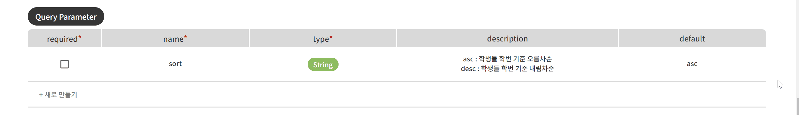 |

- 엔드포인트 정의, 메소드 정의, Response Body,Request Body  작성 어떤 요청과 응답을 받아들이는지를 상세하게 정의합니다.

## 아키텍쳐

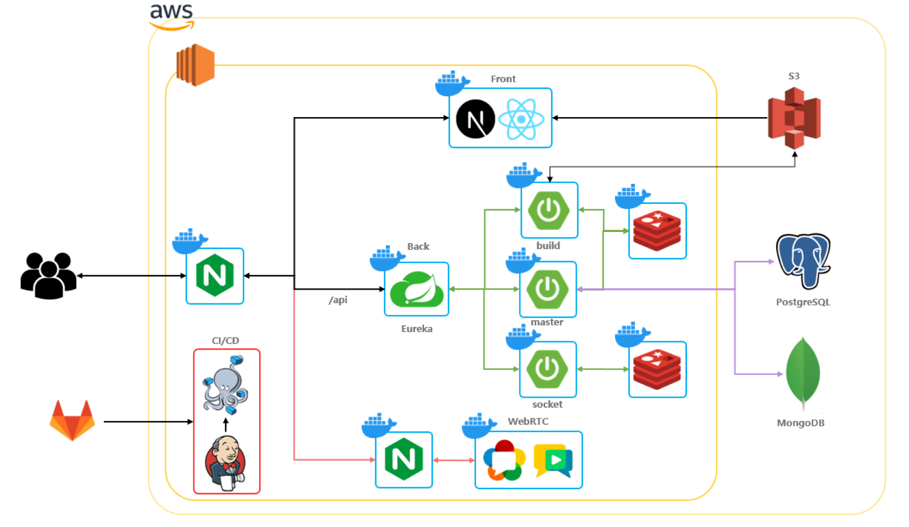

## 팀원 소개

|                  **정우현**  Back-end                  |              **유수안** Back-end/Infra               |                  **이수현** Back-end                  |                 **고석주** Front-end                  |                  **정승원** Front-end                   |             **최지우** Front-end/Design              |
| :---------------------------------------------------------: | :-------------------------------------------------------: | :--------------------------------------------------------: | :--------------------------------------------------------: | :----------------------------------------------------------: | :-------------------------------------------------------: |
|  |  |  |  |  |  |

